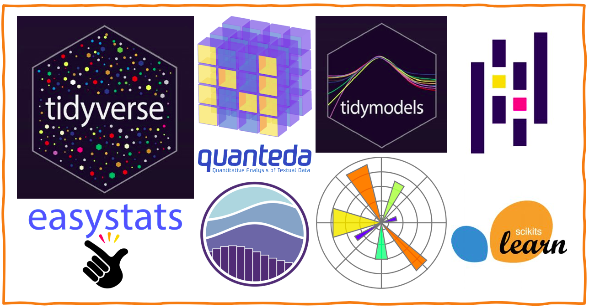

## I am a  political psychologist in training to become a data scientist.

I believe in polygamy. I actively work with

I constantly go on dates with the following libraries; I love being in their ecosystems.

Though, the [lavaan ecosystem](https://osf.io/bcy78/) is my first love. I also had a love at first sight kinda thing with the psychometric networks (maybe get an impression of what they are from [here](https://psych-networks.com/r-packages) & [here](http://psychonetrics.org)).

Feel free to reach out or 
