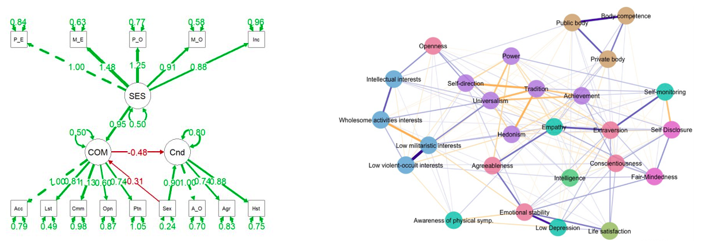

## I am a  political psychologist in training to become a data scientist

I believe in polygamy. I actively work with

I constantly go on dates with the following libraries; I love traversing their ecosystems.

Though, the [lavaan ecosystem](https://osf.io/bcy78/) is my first love. Also, I had a love at first sight kinda thing with the psychometric networks. 

The psychometric networks are relatively new; for those who have no familiarity, the following can give you a pretty good first impression. Check out [this](http://psychosystems.org/files/Literature/NetworkPsychometricsDraft.pdf), [this](https://www.rug.nl/gmw/psychology/expertise-groups/psychometrics-and-statistics/projects/main/main_1_psy_networks-in-psychology_-more-than-a-pretty-picture_?lang=en), [this](http://sachaepskamp.com/Dissertation), [this](https://psych-networks.com/r-packages) & [this](http://psychonetrics.org) maybe...

Currently, I am flirting with the following cutie pies and loving them all.

Feel free to reach out or 
